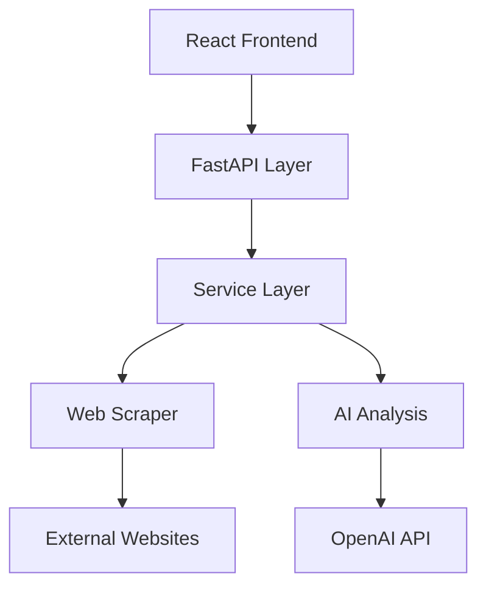
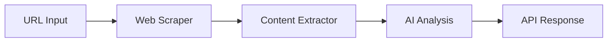

# System Architecture Analysis Report

## Project Information
- **Project Title:** Web Content Analyzer  
- **Name:** Rushitha Chittibomma
- **Review Date:** August 31st, 2025
- **Reviewer:** Github Copilot

## Executive Summary
The Web Content Analyzer is built as a monolithic FastAPI application with a React frontend, following a layered architecture pattern. Overall Architectural Quality Score: **7/10 (GOOD)**.

## 1. Overall System Architecture Evaluation

### Architectural Style
- **Primary Pattern**: Layered Monolithic Architecture
- **Component Organization**: Well-defined service layers
- **API Design**: RESTful API with FastAPI

### System Boundaries


### Communication Patterns
1. Frontend to Backend:
```python
# RESTful API endpoints with clear contracts
@app.post("/analyze")
async def analyze_url(request: AnalyzeRequest):
    result = await analyzer.analyze_url(request.url)
    return result
```

2. Service Layer Integration:
```python
class WebContentAnalyzer:
    def __init__(self):
        # Good separation of services
        self.scraping_service = ScrapingService()
        self.ai_service = AIAnalysisService()
```

## 2. Design Pattern Implementation

### Identified Patterns
1. **Service Layer Pattern**:
```python
# Well-implemented service layer
class ScrapingService:
    def __init__(self):
        self.scraper = WebScraper()
        self.extractor = ContentExtractor()
```

2. **Repository Pattern** (Partial):
```python
# Content extraction follows repository-like pattern
class ContentExtractor:
    def extract_content(self, soup: BeautifulSoup) -> Dict[str, str]:
        return {
            "title": self._extract_title(soup),
            "main_content": self._extract_main_content(soup),
            "meta_description": self._extract_meta_description(soup),
            "links": self._extract_links(soup)
        }
```

## 3. Component Architecture & Modularity

### Core Components
1. Web Scraping Module:
- Clear responsibilities
- Good encapsulation
- Appropriate error handling

2. AI Analysis Module:
- Separate concerns
- Clean integration with OpenAI
- Room for alternative implementations

### Areas for Improvement
1. Implement Dependency Injection:
```python
# Current implementation
class WebContentAnalyzer:
    def __init__(self):
        self.scraping_service = ScrapingService()

# Recommended implementation
class WebContentAnalyzer:
    def __init__(
        self,
        scraping_service: ScrapingService,
        ai_service: AIAnalysisService
    ):
        self.scraping_service = scraping_service
        self.ai_service = ai_service
```

## 4. Data Architecture Design

### Data Flow Patterns
1. Web Content Processing:


### Data Models
- Clear separation of concerns in data models
- Good validation using Pydantic
- Consistent data transformation patterns

## 5. Integration Architecture

### External Service Integration
1. OpenAI API Integration:
```python
# Well-encapsulated AI service integration
class AIService:
    def __init__(self):
        self.api_key = os.getenv("OPENAI_API_KEY")
        self.model = "gpt-3.5-turbo"
```

2. Web Scraping Integration:
```python
# Clean separation of scraping concerns
class WebScraper:
    def __init__(self, timeout: int = 30):
        self.session = requests.Session()
        self.timeout = timeout
```

## Architectural Strengths
1. Clear separation of concerns
2. Well-defined service boundaries
3. Consistent error handling patterns
4. Good API design
5. Clean data transformation flow

## Architectural Improvements Needed

### High Priority
1. Implement Dependency Injection
2. Add Interface Definitions
3. Enhance Error Handling Architecture

### Medium Priority
1. Add Caching Layer
2. Implement Event-Driven Patterns
3. Add Circuit Breakers

### Low Priority
1. Consider Microservices Migration
2. Add Message Queue for Processing
3. Implement CQRS Pattern

## Implementation Roadmap

### Phase 1 (Week 1)
1. Implement dependency injection
2. Add interface definitions
3. Enhance error handling

### Phase 2 (Month 1)
1. Add caching layer
2. Implement circuit breakers
3. Add event-driven patterns

### Phase 3 (Month 2+)
1. Consider microservices
2. Add message queues
3. Implement CQRS

## Architectural Decision Records

### ADR 1: Monolithic Architecture
- **Decision**: Use monolithic architecture initially
- **Context**: Bootcamp project with clear boundaries
- **Consequences**: Simpler deployment, potential scaling limitations

### ADR 2: Service Layer Pattern
- **Decision**: Implement service layer pattern
- **Context**: Need for clear separation of concerns
- **Consequences**: Better maintainability, slight overhead

## Conclusion
The application demonstrates good architectural practices with a clear structure and well-defined responsibilities. The monolithic approach is appropriate for the current scale, with room for evolution to microservices if needed. Focus should be on implementing dependency injection and enhancing the service layer pattern implementation.