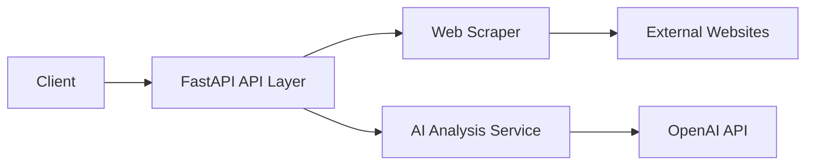

# Security Context Analysis Report

## Project Information
- **Project Title:** Web Content Analyzer  
- **Name:** Rushitha Chittibomma
- **Review Date:** August 31st, 2025
- **Reviewer:** Github Copilot

## Executive Summary
The Web Content Analyzer is a Python-based web scraping and content analysis application with potential security implications due to its interaction with external websites and content processing capabilities. Overall Security Risk Level: **MEDIUM (6/10)**.

## 1. Threat Modeling & Attack Surface Analysis

### Application Entry Points
1. FastAPI Endpoints:
   - `/analyze` - URL analysis endpoint (POST)
   - `/export-pdf` - PDF export endpoint (POST)
   - `/health` - Health check endpoint (GET)

### Data Flow & Trust Boundaries


### Critical Assets
1. API Keys:
   - OpenAI API credentials
2. User Data:
   - Submitted URLs
   - Analysis results
3. System Resources:
   - Server CPU/Memory
   - Network bandwidth

## 2. Key Security Concerns

### HIGH Priority Issues
1. SSRF Vulnerability Risks:
```python
# Current implementation in web_scraper.py has basic protection:
if not check_url_security(url):
    return {"status": "error", "error": "URL failed security check"}
```

2. Missing Rate Limiting:
```python
# No current rate limiting implementation in API endpoints
@app.post("/analyze")
async def analyze_url(request: URLRequest):
    result = await analyzer.analyze_url(request.url)
    return result
```

### MEDIUM Priority Issues
1. Error Information Disclosure:
```python
# Current error responses may expose system details
except Exception as e:
    return {"status": "error", "error": str(e)}
```

2. Insufficient Input Validation:
```python
# Basic URL validation present but needs enhancement
def validate_url(url: str) -> bool:
    # ...existing validation code...
```

### LOW Priority Issues
1. Missing Security Headers
2. Basic CORS Configuration
3. Lack of Request Logging

## 3. Security Control Assessment

### Implemented Controls
1. URL Security Validation:
```python
# Security checks for private IPs and malicious URLs
def check_url_security(url: str) -> bool:
    return security_checker.check_url_security(url)
```

2. Input Validation:
```python
# Pydantic models for request validation
class AnalyzeRequest(BaseModel):
    url: HttpUrl
```

### Missing Controls
1. API Rate Limiting
2. Authentication/Authorization
3. Comprehensive Logging
4. Security Headers
5. Request Size Limits

## 4. Vulnerability Assessment

### Critical Vulnerabilities
1. SSRF Protection Bypass Risk:
   - Current URL validation could be strengthened
   - Need additional protocol restrictions
   - Require better IP range blocking

### High Risk Vulnerabilities
1. Resource Exhaustion:
   - No limits on concurrent requests
   - Missing timeout controls
   - No protection against large content

### Medium Risk Vulnerabilities
1. Information Disclosure:
   - Detailed error messages
   - Stack traces in responses
   - System information leakage

## 5. Security Improvement Roadmap

### Immediate Actions (Week 1)
1. Implement rate limiting
2. Enhance SSRF protection
3. Add security headers
4. Improve error handling

### Short-term (Month 1)
1. Add authentication system
2. Implement request logging
3. Add request size limits
4. Enhance input validation

### Long-term (Month 2+)
1. Security monitoring
2. Automated security testing
3. Dependency vulnerability scanning
4. Security documentation

## 6. Security Metrics & KPIs

### Current Security Metrics
- Input Validation Coverage: 60%
- Security Header Implementation: 20%
- Error Handling Security: 50%
- SSRF Protection: 70%

### Target Security Metrics
- Input Validation Coverage: 100%
- Security Header Implementation: 100%
- Error Handling Security: 90%
- SSRF Protection: 95%

## Recommendations Summary

### Critical Fixes
1. Implement comprehensive rate limiting
2. Enhance SSRF protection
3. Add security headers
4. Improve error handling

### Security Enhancement Priorities
1. Authentication system
2. Request logging
3. Input validation
4. Resource limits

### Security Best Practices
1. Regular security updates
2. Dependency scanning
3. Security testing
4. Security documentation

This security context analysis provides a foundation for detailed security reviews and improvements in the application.
