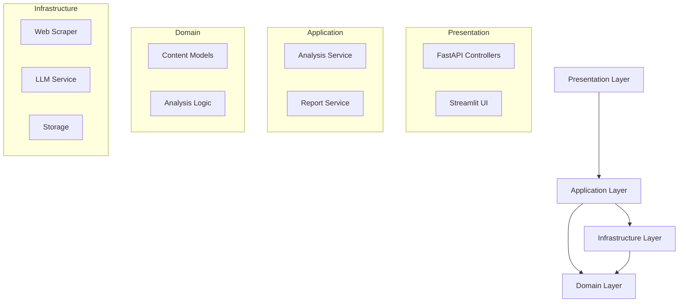

# System Architecture Analysis Report

## Project Information
- **Project Title:** Smart Knowledge Repository  
- **Name:** Goutham Kasula
- **Review Date:** 2025-Sep-08
- **Reviewer:** Github Copilot


## Executive Summary

The Web Content Analyzer demonstrates a **GOOD (8/10)** architectural implementation with clean layered architecture, well-defined domain boundaries, and proper separation of concerns. The system follows domain-driven design principles with a clear distinction between domain, application, and infrastructure layers.

## 1. Overall System Architecture Evaluation

### Architectural Style
- **Primary Pattern**: Clean Architecture with Domain-Driven Design
- **Implementation**: Modular Monolith with clear boundaries
- **Score**: 8/10

### System Structure


### Technology Stack Integration
```python
# Clean separation of infrastructure concerns
from src.infrastructure.llm.service import ProductionLLMService
from src.infrastructure.web.scrapers.production import ProductionWebScraper
from src.infrastructure.persistence.content_repository import ContentRepository

class ContentAnalysisService:
    def __init__(
        self, 
        scraping_service: IWebScraper,
        llm_service: ILLMService,
        db_path: str
    ):
        self.scraping_service = scraping_service
        self.llm_service = llm_service
        self.content_repository = ContentRepository(db_path)
```

## 2. Design Pattern Implementation

### Identified Patterns
1. **Repository Pattern**
   ```python
   class ContentRepository:
       """Repository pattern for data access abstraction"""
       def __init__(self, db_path: str):
           self.db_path = db_path
   ```

2. **Strategy Pattern**
   ```python
   @runtime_checkable
   class ILLMProvider(Protocol):
       """Strategy pattern for LLM providers"""
       async def generate_response(self, request: LLMRequest) -> LLMResponse: ...
   ```

3. **Factory Pattern**
   ```python
   class LLMServiceFactory:
       @staticmethod
       def create_service(config: LLMServiceConfig) -> ILLMService:
           if config.mock_enabled:
               return MockLLMService(config)
           return ProductionLLMService(config)
   ```

## 3. Domain Architecture Analysis

### Domain Model Design
✅ Strong domain model encapsulation:
```python
@dataclass(frozen=True)
class URLInfo:
    """Value object for URL information"""
    url: str
    domain: str
    is_secure: bool
    path: str
```

### Business Logic Organization
✅ Clear separation of business rules:
```python
class ContentClassificationService:
    """Domain service for content classification"""
    def classify_content(self, content: ScrapedContent) -> ContentType:
        # Domain logic for content classification
```

## 4. Layer Architecture Analysis

### Layer Separation
- **Presentation**: FastAPI routes and Streamlit UI
- **Application**: Services orchestrating use cases
- **Domain**: Core business logic and models
- **Infrastructure**: External integrations and technical concerns

### Layer Dependencies
```python
# Clear dependency flow from outer to inner layers
from src.domain.models import AnalysisResult  # Domain models
from src.application.interfaces.llm import ILLMService  # Application interfaces
from src.infrastructure.llm.service import ProductionLLMService  # Infrastructure
```

## 5. Integration Architecture

### External Service Integration
✅ Well-defined integration boundaries:
```python
class ProductionLLMService(ILLMService):
    """Clean integration with LLM providers"""
    async def analyze_content(self, request: AnalysisRequest) -> LLMResponse:
        # Structured integration with error handling
```

## 6. Performance Architecture

### Scalability Design
✅ Asynchronous operations:
```python
async def analyze_url(self, url: str) -> AnalysisResult:
    """Async analysis pipeline for better scalability"""
    scraped_content = await self.scraping_service.scrape(url)
    analysis = await self.llm_service.analyze(scraped_content)
```

## Priority Recommendations

### High Priority
1. Implement circuit breakers for external services
2. Add caching layer for analysis results
3. Enhance error recovery patterns

### Medium Priority
1. Add event-driven communication
2. Implement CQRS pattern for analysis queries
3. Add metrics collection architecture

### Low Priority
1. Add feature toggles infrastructure
2. Implement advanced caching strategies
3. Add distributed tracing

## Architectural Decision Records

### ADR 1: Clean Architecture Selection
- **Context**: Need for maintainable and testable codebase
- **Decision**: Implemented Clean Architecture with DDD
- **Status**: Accepted
- **Consequences**: Better maintainability but increased initial complexity

### ADR 2: Modular Monolith
- **Context**: Need for system simplicity and future scalability
- **Decision**: Started with modular monolith design
- **Status**: Accepted
- **Consequences**: Easier development and deployment, potential future microservices path

## Conclusion

The system demonstrates strong architectural foundations with clear separation of concerns and well-defined boundaries. Main improvement opportunities lie in:

1. Enhanced resilience patterns
2. Advanced caching strategies
3. Metrics and monitoring architecture

**Architecture Quality Grade: B+ (Good with Clear Growth Path)**

**Next Steps:**
1. Implement critical architectural enhancements
2. Add architectural documentation
3. Set up architectural decision tracking
